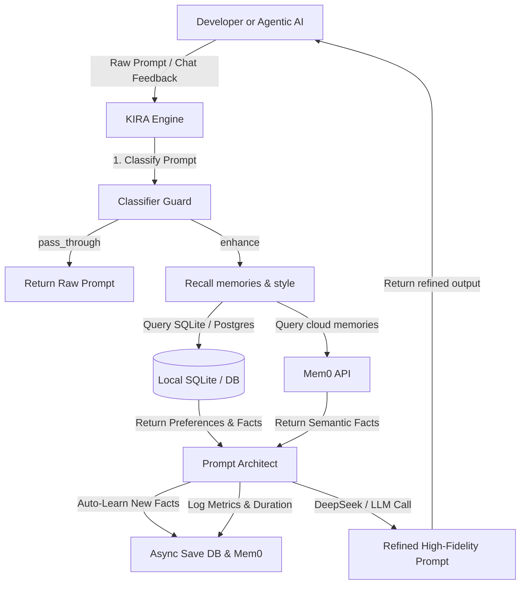

# KIRA Prompt Refinement Engine: Comprehensive Report & User Manual

KIRA is an architectural prompt-engineering hub designed to intercept, refine, and contextualize developer prompts. By blending a stateful local memory system (using SQLite/Postgres or Mem0 cloud) with high-fidelity LLM instruction generators, KIRA ensures that AI development agents operate with maximum precision and alignment to project-specific constraints.

---

## 1. Project Overview & Architecture

KIRA sits between the human developer (or agentic AI coding assistants) and LLM providers. It exposes both a FastMCP server interface for direct agentic consumption, and a modular FastAPI + React web application console for manual prompt refinement and monitoring.

### Conceptual Architecture



### Technology Stack
- **Backend Core**: Python 3.11+, FastAPI (for HTTP endpoints & WebSockets).
- **LLM Pipeline**: DeepSeek-Chat API (default) with automatic fallback to Pollinations.ai (keyless OpenAI-compatible interface).
- **State & Memory Layer**: Dual-mode Database Manager supporting asynchronous PostgreSQL (via `asyncpg` for multi-user supabase production instances) and SQLite (via `sqlite3` for zero-config local development).
- **Agent Integration**: Model Context Protocol (FastMCP) serving StdIO tools.
- **Frontend SPA**: React 19 + TypeScript + Vite, styled using a custom Neon-Brutalist CSS design system.

---

## 2. Architecture Deep Dive

### A. The Classifier Guard (`classifier.py`)
To prevent unnecessary API latency and costs, KIRA runs a fast heuristic classifier over incoming prompts:
- **Pass-through triggers**: Shell commands (e.g. `git push`), short confirmations (`yes`, `continue`), extremely short requests (<5 words), extremely detailed prompts (>200 words), pasted code blocks, or explicit bypass prefixes (`!`).
- **Enhancement triggers**: Vague queries ("make a login screen") or complex instruction requests.

### B. Dual-Mode DB Adapter (`database.py`)
All settings, memories, histories, and metrics are written using parameterized queries. The adapter automatically handles SQLite syntax variations (e.g., converting `$1` parameters to `?` and handling SQLite's lack of `ON CONFLICT` support via `INSERT OR REPLACE` fallback).

### C. FastMCP Instrumenter (`mcp_server.py`)
All registered MCP tools are wrapped in KIRA's custom `@traced_tool` decorator, which logs:
- Method duration (ms)
- Caller identity (`antigravity`, `opencode`, or `frontend`)
- Query parameters (safely serialized and truncated to protect memory bounds)
- Execution status (`success` or `error`)

---

## 3. Use Case Scenarios

### Scenario 1: The Solo Local Developer
- **Objective**: Improve code generations inside local IDEs (like Cursor or VS Code) without hosting complex services.
- **KIRA Setup**: Local SQLite (`kira_local.db`) + DeepSeek API key.
- **Benefits**: KIRA automatically learns tech stacks and constraints from local work, appending them to prompts invisibly.

### Scenario 2: Multi-Agent Collaboration
- **Objective**: Align different coding agents (e.g., Google Antigravity, Claude Code, OpenCode) on the same project rules.
- **KIRA Setup**: Hosted KIRA server connected to the project's repository.
- **Benefits**: Shared semantic memory. When `antigravity` discovers that a database index is missing, KIRA remembers it, so that when `Claude Code` later writes a query, KIRA refines its prompt to automatically include that database constraint.

### Scenario 3: Hosted Team Platform
- **Objective**: Establish consistent prompt-engineering standards across an enterprise team.
- **KIRA Setup**: Multi-tenant Supabase Postgres instance + Mem0 cloud integration.
- **Benefits**: Shared team-wide code guidelines, central auditing of prompt refinements, and query duration analytics.

---

## 4. Tutorials

### Tutorial 1: Getting Started from Scratch

#### Step 1: Install Dependencies
```bash
# Set up Python virtual environment
cd backend
python -m venv .venv
.venv\Scripts\activate
pip install -r requirements.txt
```

#### Step 2: Configure Environment
Create a `.env` file in the `backend/` directory:
```env
PORT=8090
DATABASE_MODE=local
DEEPSEEK_API_KEY=your-api-key-here
# Optional Mem0 memory tracker:
MEM0_API_KEY=your-mem0-key
```

#### Step 3: Run the Services
```bash
# Start backend
python main.py

# Start frontend
cd ../frontend
npm install
npm run dev
```

---

### Tutorial 2: Configuring KIRA MCP in Your IDE

Add the following to your IDE's global MCP settings file (typically `mcp_config.json` under your IDE's app data directory):

```json
{
  "mcpServers": {
    "kira-partner": {
      "command": "python",
      "args": [
        "c:/Users/user/OneDrive/Desktop/KIRA/backend/mcp_server.py"
      ],
      "env": {
        "DEEPSEEK_API_KEY": "your-api-key-here",
        "DATABASE_MODE": "local"
      }
    }
  }
}
```

---

### Tutorial 3: Building a Custom Agent that calls `kira_enhance`

If you are developing a custom agent or coding script in Python, you can fetch KIRA's context-refined prompts programmatically:

```python
import asyncio
from mcp import ClientSession, StdioServerParameters
from mcp.client.stdio import stdio_client

async def generate_code():
    # 1. Define server parameters
    server_params = StdioServerParameters(
        command="python",
        args=["c:/Users/user/OneDrive/Desktop/KIRA/backend/mcp_server.py"]
    )
    
    # 2. Call KIRA's enhance tool
    async with stdio_client(server_params) as (read, write):
        async with ClientSession(read, write) as session:
            await session.initialize()
            
            raw_prompt = "add a login route in FastAPI"
            refined_prompt = await session.call_tool(
                "kira_enhance",
                arguments={
                    "prompt": raw_prompt,
                    "agent_name": "custom-script-agent",
                    "session_id": "session-101",
                    "density": "short"
                }
            )
            
            print("KIRA Prompt Refinement:\n", refined_prompt.content[0].text)

if __name__ == "__main__":
    asyncio.run(generate_code())
```

---

## 5. Advanced Examples

### Example 1: Custom Skip Logic Rule Setup
If you want KIRA to automatically pass through instructions related to database migrations without calling the LLM refiner, update the rules list in `classifier.py`:

```python
# In classifier.py:
MIGRATION_KEYWORDS = {"alembic", "db upgrade", "flyway", "db migrate"}

# Inside classify(prompt):
if any(kw in cleaned.lower() for kw in MIGRATION_KEYWORDS):
    return {
        "action": "pass_through",
        "reason": "Database migration command detected"
    }
```

### Example 2: Programmatic Batch Refinement Script
Use KIRA's API endpoints to batch-refine multiple user prompts for system evaluation:

```python
import requests
import json

prompts = [
    "create a simple counter in react",
    "write a binary search in python",
    "explain OAuth2 flow"
]

for p in prompts:
    res = requests.post("http://localhost:8090/api/v1/refine", json={
        "prompt": p,
        "density": "short",
        "session_id": "batch-eval"
    })
    
    if res.status_code == 200:
        data = res.json()
        print(f"Original: {p}")
        print(f"Refined: {data['refined_prompt'][:150]}...")
        print(f"Quality Metrics: {data['quality_scores']}\n" + "="*40)
```

---

## 6. API Endpoint Reference

### `POST /api/v1/refine`
Refines a prompt using saved profile traits and auto-extracted memory constraints.
- **Request Body**:
  ```json
  {
    "prompt": "string",
    "density": "short | medium | detailed",
    "session_id": "string"
  }
  ```
- **Response**:
  ```json
  {
    "refined_prompt": "Markdown formatted prompt instructions...",
    "intent": "refinement",
    "domain": "web_development",
    "new_memories": ["Extracted fact 1"],
    "quality_scores": {
      "specificity": 4.5,
      "clarity": 5.0,
      "actionability": 4.5
    }
  }
  ```

### `POST /api/v1/chat`
Performs conversational updates on a refined prompt (e.g. "now write it in Go").
- **Request Body**:
  ```json
  {
    "message": "string",
    "session_id": "string"
  }
  ```
- **Response**:
  ```json
  {
    "response": "Brief chat response...",
    "refined_prompt": "Full updated prompt instruction markdown..."
  }
  ```

### `GET /api/v1/mcp/status`
Returns process status of configured MCP servers.
- **Response**:
  ```json
  {
    "servers": [
      {
        "name": "sqlite",
        "command": "npx -y @modelcontextprotocol/server-sqlite",
        "args": ["db.sqlite"],
        "status": "connected",
        "pid": 10452
      }
    ]
  }
  ```
