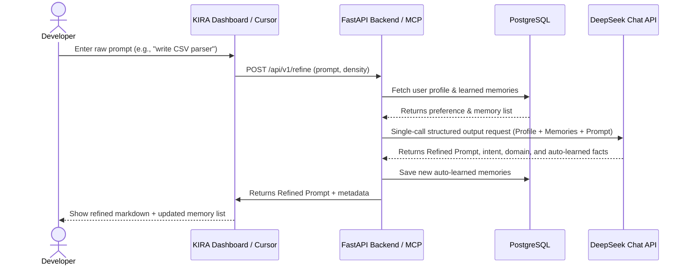

# Product Requirements Document (PRD): KIRA

## 1. Executive Summary & Vision

**KIRA** (formerly PromptForge) is a lightweight, context-aware prompt refinement system designed to run as an IDE-native partner (via MCP) and as a standalone local web application.

Standard AI assistants evaluate prompts in isolation, which requires developers to manually repeat details about their OS, tech stack, coding standards, and architectural preferences. KIRA solves this by keeping a lightweight, persistent database of developer preferences and context facts, automatically weaving them into every refinement request while keeping prompt outputs highly dense to protect editor context windows.

---

## 2. Core Value Proposition

* **Stateful Context Injection:** KIRA automatically learns and recalls facts like *"prefers React + TypeScript"* and applies them dynamically to incoming prompts.
* **Density-Budgeting:** Prevent prompt inflation from eating the IDE's prompt context. Controls output using explicit modes (`short`, `medium`, `detailed`).
* **Zero Swarm Latency:** Uses a single LLM structured call rather than a slow multi-agent network swarm, enabling sub-second response times.
* **Seamless Local-to-Cloud DB Parity:** Leverages PostgreSQL (via direct URL) to easily run locally or deploy to cloud-hosted databases (Neon/Supabase) with zero code change.

---

## 3. Scope & Requirements

### 3.1. High-Level Feature List
1. **Refinement Console:** Multi-line text field with segmented controllers for output density (`short`, `medium`, `detailed`).
2. **Context Memory Store:** Visual list showing auto-learned and manual context items (e.g., tech stack elements) with options to delete or add facts.
3. **Iterative Refinement Chat:** Follow-up conversational input to refine prompts further (e.g. "make it async", "wrap it in a class").
4. **IDE Integration (MCP Server):** Stdio MCP server exposing tools (`forge_refine`, `forge_chat`, `get_kira_memories`) for Cursor or Claude Desktop.

### 3.2. Out-of-Scope (for MVP)
* OpenTelemetry monitoring (Jaeger, Sentry, Langsmith).
* Redis caching and gamification engines.
* OAuth social logins (relies on local/direct Postgres credentials).

---

## 4. User Interaction Flows

