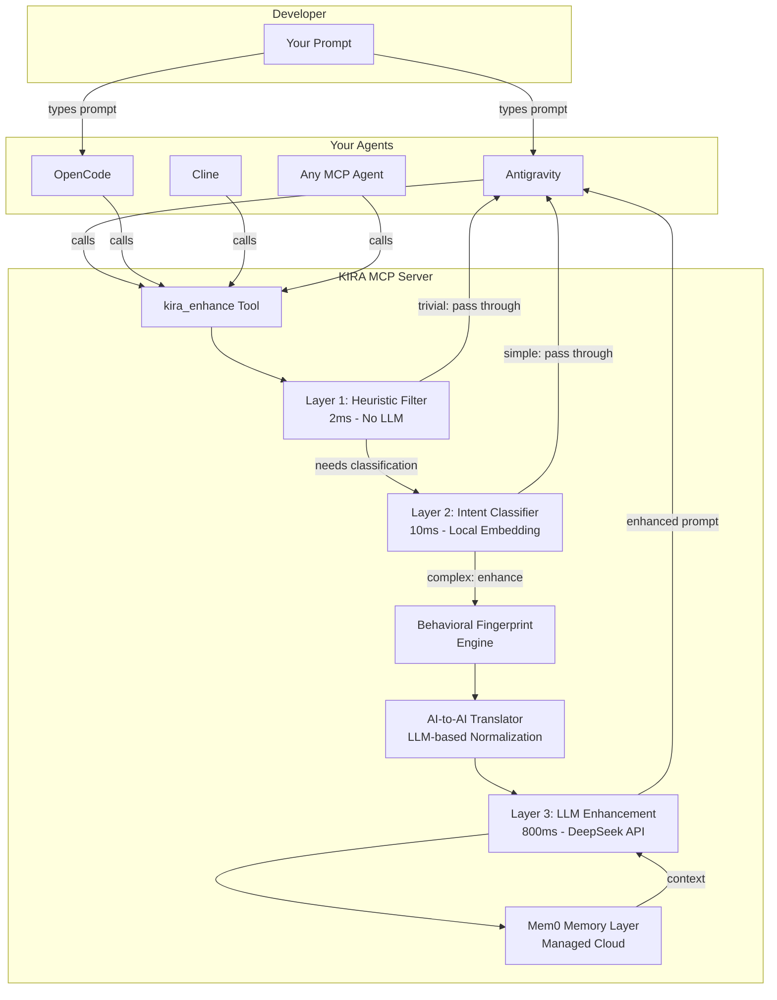

# KIRA v4 — Product Requirements Document

## 1. Executive Summary

**KIRA** (Knowledge-Informed Reasoning Assistant) is a self-learning, personal prompt-optimizing MCP server that sits between a developer and their AI coding agents. It intercepts prompts, decides whether they need enhancement, translates sloppy human language into structured agent-optimized instructions, and learns from outcomes — all without requiring explicit user intervention.

KIRA is NOT a prompt refiner you invoke manually. It's a smart MCP tool that agents call automatically based on rules. It learns YOUR patterns, YOUR vocabulary, YOUR preferences, and gets better over time.

---

## 2. Core Value Proposition

| Value | How |
|---|---|
| **Self-learning** | Builds behavioral fingerprint from past prompts. Adapts without being taught. |
| **AI-to-AI Translation** | Converts sloppy human shorthand ("do the thing like before") into structured instructions agents parse perfectly. |
| **Smart Silence** | Three-layer classifier decides in <10ms whether to enhance or pass through. Doesn't over-engineer simple commands. |
| **Universal Compatibility** | Standard MCP server. Works with Antigravity, OpenCode, Cline, and any MCP-compatible agent. |
| **Persistent Memory** | Mem0-powered semantic memory with deduplication, entity linking, and temporal decay. |
| **Nearly Free** | DeepSeek at ~$0.42/month. Only complex prompts hit the LLM. |

---

## 3. Architecture Overview



---

## 4. Decisions Locked

| Decision | Choice | Rationale |
|---|---|---|
| **Architecture** | Smart MCP Tool (Option B) | 5x cheaper to build and run than proxy. No single-point-of-failure. |
| **LLM Provider** | DeepSeek only | Cheapest ($0.14/M tokens). OpenAI-compatible API. ~$0.42/month at 1M tokens. |
| **Memory Backend** | Mem0 Managed Cloud | Zero maintenance. Free tier (10K adds, 1K searches/month). Access anywhere. Never used before — managed is easiest onramp. |
| **Skip Logic** | Three-layer classifier | Heuristic → Embedding → LLM fallback. 70% of prompts cost zero tokens. |
| **AI-to-AI Translation** | LLM-based normalization | Full rewrite via DeepSeek. Handles sloppy language, references, context injection. |
| **Behavioral Fingerprint** | Phase 2 (see BUILD_PLAN.md) | Needs prompt history data from Phase 1 first. |
| **Target Agents** | Any MCP-compatible agent | Antigravity, OpenCode, Cline, Claude Desktop, and anything that speaks MCP. |

---

## 5. Feature Specifications

### 5.1 MCP Tools (Phase 1 - MVP)

#### `kira_enhance(prompt, agent_name, session_id, force)`
- **Input:** Raw prompt string + metadata
- **Process:** Classify → Retrieve memory → Normalize → Enhance (if needed)
- **Output:** Enhanced prompt string OR original prompt (if pass-through)
- **Latency target:** <50ms for pass-through, <1s for full enhancement

#### `kira_feedback(prompt_id, outcome)`
- **Input:** ID of previously enhanced prompt + outcome signal
- **Outcome values:** `"accepted"` | `"rejected"` | `"modified"`
- **Process:** Updates memory relevance scores. Trains skip classifier.

#### `kira_memories(agent_name)`
- **Input:** Optional agent filter
- **Output:** Current memory state as formatted string

#### `kira_status()`
- **Input:** None
- **Output:** KIRA health, memory count, enhancement stats, fingerprint summary

### 5.2 Three-Layer Skip Classifier

| Layer | Speed | Cost | Catches |
|---|---|---|---|
| **L1: Heuristic** | ~2ms | $0 | `!` bypass prefix, <10 tokens, >200 tokens, pure code |
| **L2: Intent Classifier** | ~10ms | $0 | `command`, `question`, `task_simple`, `continuation` |
| **L3: LLM Enhancement** | ~800ms | ~$0.0004/call | `task_complex`, `exploration`, ambiguous (confidence <0.6) |

### 5.3 Memory (Mem0 Managed Cloud)

**Scopes:**
- `user_id="local_user"` — global memories (tech stack, preferences)
- `agent_id="opencode"` — per-agent memories
- `run_id=session_id` — session-specific context

**Operations:**
- `add()` — triggered by LLM extraction during enhancement
- `search()` — triggered during enhancement to retrieve relevant context
- `get_all()` — triggered by `kira_memories` tool

### 5.4 AI-to-AI Translation (LLM-Based)

**Process:**
1. Receive sloppy human prompt
2. Search Mem0 for relevant memories and past patterns
3. Call DeepSeek with structured prompt:
   ```
   System: You are KIRA, a prompt translator. Convert the user's 
   casual prompt into a structured, agent-optimized instruction set.
   
   User memories: [injected from Mem0]
   Past similar prompts: [injected from history]
   
   Rules:
   - Resolve vague references ("the thing", "like before") using memories
   - Add tech stack constraints from memories
   - Structure as: [Task] + [Context] + [Constraints] + [Expected Output]
   - Keep it concise — agents have context window limits
   ```
4. Return structured prompt to the calling agent

---

## 6. Scalability Design

MVP is built with Phase 2 and 3 in mind:

| Component | MVP State | Phase 2 Extension Point | Phase 3 Extension Point |
|---|---|---|---|
| **Memory** | Mem0 managed cloud | Add per-agent scoping | Add DSPy training data export |
| **Classifier** | Heuristic + embedding | Add fingerprint-aware rules | Add feedback-trained model |
| **Enhancement** | DeepSeek single-call | Add template cache | DSPy-compiled templates |
| **Analytics** | Basic logging to SQLite | Behavioral fingerprint | Full observatory dashboard |
| **MCP Tools** | 4 tools | Add `kira_patterns` | Add `kira_observatory` |

---

## 7. Non-Goals (Explicit Out-of-Scope)

- ❌ Web UI / Dashboard (Phase 1 — CLI/MCP only)
- ❌ Multi-user support (personal tool, single user)
- ❌ Custom LLM hosting (use DeepSeek API)
- ❌ Autonomous agent behavior (KIRA is a tool, not an agent)
- ❌ MCP Gateway/Proxy architecture (use Smart Tool + auto-rules instead)
