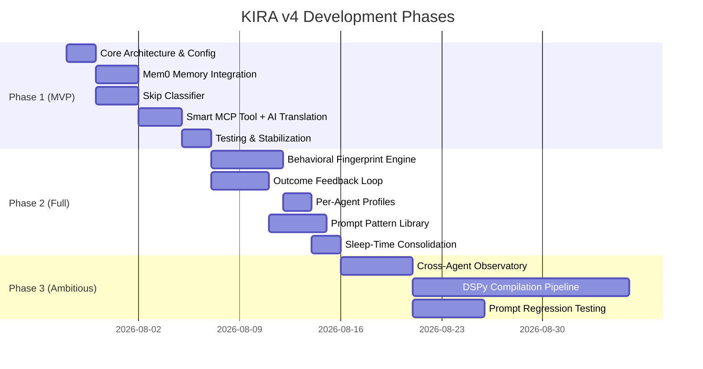

# When — KIRA v4 Development Timeline

## Phase Overview

## Phase 1: MVP — ~13-14 days
**Start:** July 28, 2026  
**Target:** August 10, 2026

| Week | Days | Deliverable |
|---|---|---|
| Week 1 (Jul 28 - Aug 1) | Day 1-2 | Core architecture: new project structure, config, Mem0 setup |
| | Day 3-5 | Mem0 memory integration + Skip classifier (parallel) |
| Week 2 (Aug 4 - Aug 8) | Day 6-8 | Smart MCP tools + LLM-based AI-to-AI translation layer |
| | Day 9-10 | Enhancement pipeline: connect classifier → memory → translator → output |
| Week 2-3 (Aug 8-10) | Day 11-13 | Testing, edge cases, agent config templates, stabilization |

**MVP Delivers:**
- [x] Mem0-powered memory (replaces flat SQLite)
- [x] Three-layer skip classifier (heuristic → embedding → LLM)
- [x] LLM-based prompt normalization (human-to-AI translation)
- [x] Smart MCP server with `kira_enhance`, `kira_feedback`, `kira_memories`
- [x] DeepSeek as LLM provider
- [x] Works with any MCP-compatible agent

## Phase 2: Full — ~17 days
**Start:** August 11, 2026  
**Target:** August 29, 2026

| Deliverable | Days | Depends On |
|---|---|---|
| Behavioral Fingerprint Engine | 5 | MVP complete |
| Outcome Feedback Loop | 4 | MVP complete |
| Per-Agent Memory Profiles | 2 | Fingerprint done |
| Prompt Pattern Library + Auto-Templates | 4 | Feedback loop done |
| Sleep-Time Memory Consolidation | 2 | Per-Agent done |

**Phase 2 Delivers:**
- [ ] KIRA tracks your behavior and adapts automatically
- [ ] Closed-loop self-learning from prompt outcomes
- [ ] Different enhancement strategies per agent
- [ ] Auto-detected prompt templates from repeated patterns
- [ ] Background memory cleanup and deduplication

## Phase 3: Ambitious — ~25 days
**Start:** September 1, 2026  
**Target:** September 30, 2026

| Deliverable | Days | Depends On |
|---|---|---|
| Cross-Agent Observatory Dashboard | 5 | Phase 2 complete |
| DSPy Compilation Pipeline | 15 | 3 months of data collected |
| Prompt Regression Testing | 5 | Observatory done |

**Phase 3 Delivers:**
- [ ] Analytics dashboard showing prompt effectiveness across agents
- [ ] Self-optimizing prompt templates via DSPy compilation
- [ ] Regression testing to prevent quality degradation

## Key Dependencies & Risks

| Risk | Impact | Mitigation |
|---|---|---|
| Mem0 managed platform rate limits | Blocks memory ops | Cache locally, batch writes |
| DeepSeek API downtime | Enhancement fails | Graceful fallback to pass-through |
| Embedding model too slow on CPU | Classifier bottleneck | Use quantized MiniLM or FastText |
| Too many orphaned MCP processes on Windows | RAM bloat | Implement process lifecycle hooks |
